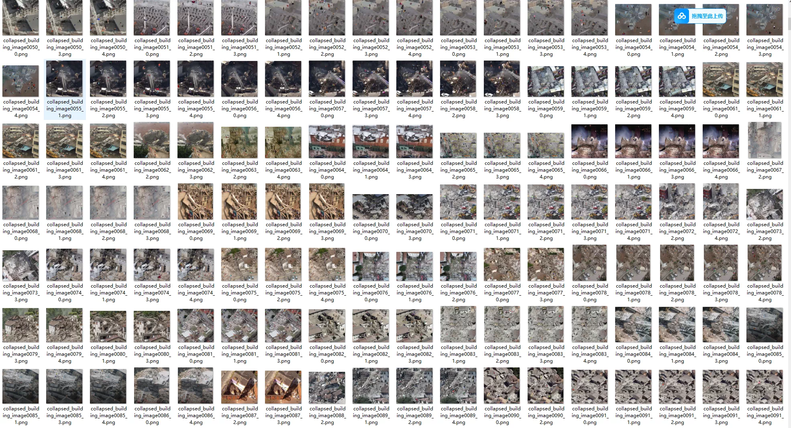
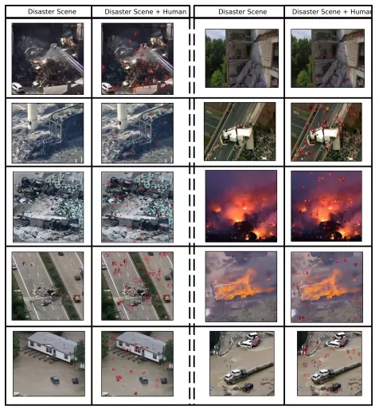
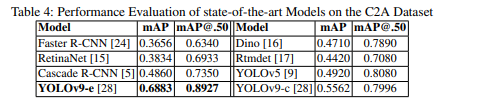
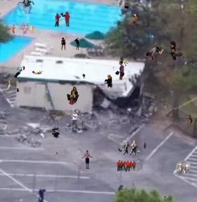
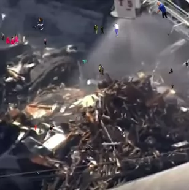
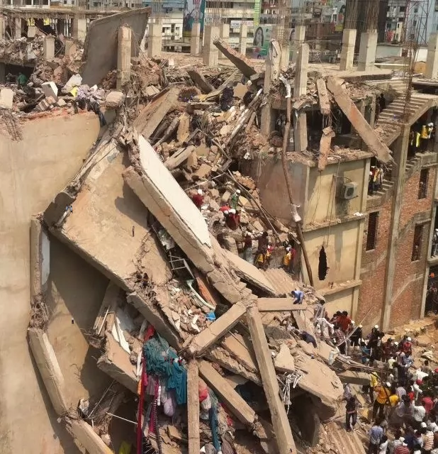
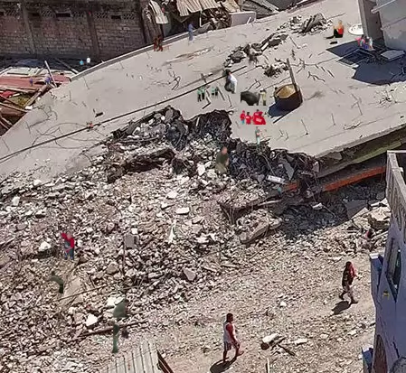

## Body

Disaster Scene Human Detection Dataset in YOLO and COCO formats

C2A dataset is a comprehensive combination of two main sources:
Disaster background: derived from AIDER (Emergency Response Application Aerial Imagery Dataset), providing real-life disaster scene images.
Human pose: originated from LSP/MPII-MPHB (Multi-Pose Human) dataset, offering various human poses.

Key features:
10,215 high-resolution images
Over 360,000 annotated human instances
5 human pose categories: Supine, Kneeling, Lying, Seated, and Upright
4 disaster scenarios types: Fire/Smoke, Flood, Collapsed Building/Debris, and Traffic Accident
Image resolution ranges from 123x152 to 5184x3456 pixels
Bounding box annotations for each human instance

Electronic virtual products are not returnable or exchangeable.

## Images

Here is a pay link on Stripe ( https://buy.stripe.com/3cs8yP7sY87d0vu9AB ). Please contact me lonlonago@foxmail.com after funding $89, and I will send you a complete data files , thank you!

